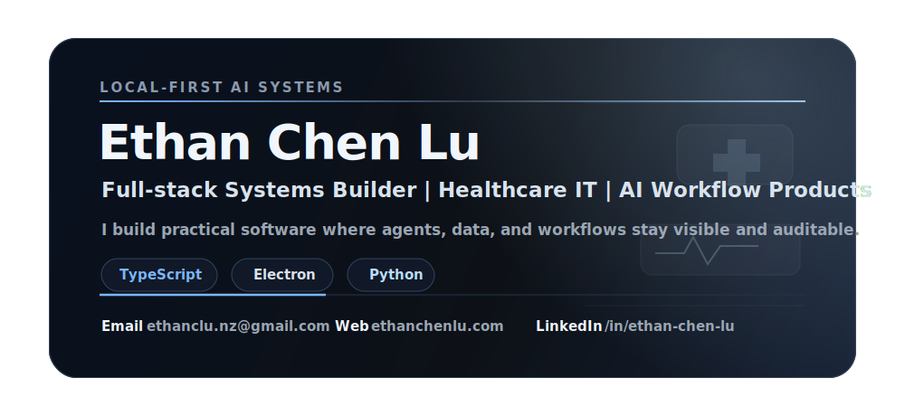

  

  <a href="https://ethanchenlu.com">Portfolio</a>
  &nbsp;/&nbsp;
  <a href="https://www.linkedin.com/in/ethan-chen-lu/">LinkedIn</a>
  &nbsp;/&nbsp;
  <a href="mailto:ethanclu.nz@gmail.com">Email</a>
  &nbsp;/&nbsp;
  <a href="https://github.com/lupanpan1030/agent-code-for-me">Locus</a>
  &nbsp;/&nbsp;
  <a href="https://www.ideasenseai.com">IdeaSense AI</a>
  &nbsp;/&nbsp;
  <a href="https://github.com/lupanpan1030?tab=repositories">Repositories</a>

  
  
  
  
  
  
  
  
  
  

